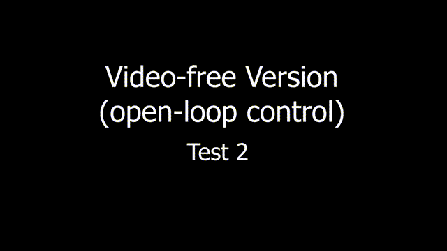

# Basics of mobile robotics - Final project

## Thymio - Vision Guided Navigation

| **Test passed**                                              |
| ------------------------------------------------------------ |
|  |

> **Students : [Chuanfang Ning](https://github.com/Chuanfang-Neptune), [Jianhao Zheng](https://github.com/Jianhao-zheng), [Ju Wu](https://github.com/JuWu-19), Yujie He**
>
> (Names in alphabetical order)

### Overview

This project aims to combine vision, path planning, local navigation, and filtering to maneuver a Thymio robot on a map towards a goal. We have realized two types of implementations, i.e., vision-guided and vision-free version.

For the former implementation, the image of the experimental site is first captured by the webcam. The necessary map information, including the robot pose, map, static obstacles, and the goal position, is extracted in a real-time fashion by utilizing the classic image processing techniques. Afterward, the A* algorithm computes the optimal path. It sends the instructions for the global controller of the Thymio robot, which gives instructions to the motors to follow the optimal path. If Thymio detects an obstacle ahead via the horizontal proximity sensors, local navigation will take over the robot's movement to avoid collisions. Also, one can kidnap the Thymio robot, it can still find the way to the goal position.

For the latter, the overall scene is simplified by manually selecting the start and goal positions. Afterward, A* is similarly used for optimal path calculation and the associated control command output. After that, the robot walks along the path while the Kalman filter performs position estimation at a certain frequency.

### Demo

|                                    |                   |
| ---------------------------------- | ----------------- |
| Test                               | Demo              |
| Image Processing from Webcam       |  |
| Kidnapping Test                    |  |
| Local Navigation Test              |  |
| Navigation with Kalman Filter Test |  |

**For more information, the demo video is available as [`MICRO-452_Demo_Video.mp4`](https://github.com/hibetterheyj/Thymio_Vision_Guided_Navigation/blob/master/MICRO-452_Demo_Video.mp4).**

